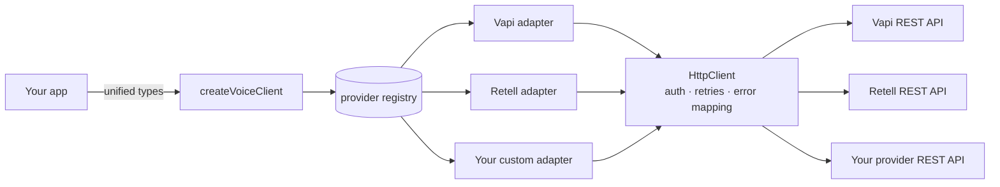

# VoiceBridge

> One SDK for voice AI agents. Switch between Vapi, Retell and more — no vendor lock-in.

VoiceBridge gives you a single, typed interface over multiple voice-AI providers.
Write your integration once against unified `Agent`, `Call` and `PhoneNumber`
types, and switch the underlying provider by changing one config line.

- ESM-first, TypeScript-first, zero `any` in the public API
- Node 18+ (uses global `fetch`, no `axios`)
- Tiny: one runtime dependency (`zod`)
- Typed errors, automatic retries with backoff, and lazy pagination
- A provider-adapter pattern so you can bring your own provider

## Install

```bash
npm install @yewe/voicebridge zod
```

## Quickstart

```ts
import { createVoiceClient } from "@yewe/voicebridge";

// Swap "vapi" -> "retell" and nothing else changes.
const client = createVoiceClient({
  provider: "vapi",
  apiKey: process.env.VAPI_API_KEY!,
});

const agent = await client.agents.create({
  name: "Front Desk",
  systemPrompt: "You are a friendly receptionist.",
  firstMessage: "Hi! How can I help?",
  voice: "burt",
});

const call = await client.calls.create({
  agentId: agent.id,
  to: "+15551234567",
});
console.log(call.status); // "queued" | "in-progress" | "completed" | ...
```

## Supported providers

| Provider       | Name     | Agents | Calls | Phone numbers | Extras                 |
| -------------- | -------- | :----: | :---: | :-----------: | ---------------------- |
| Vapi           | `vapi`   |   ✅   |  ✅   |      ✅       | —                      |
| Retell AI      | `retell` |   ✅   |  ✅   |      ✅       | Knowledge bases        |
| Bring your own | _any_    |   ✅   |  ✅   |      ✅       | Whatever you implement |

## Unified API

Every provider exposes the same resources and methods.

```ts
// Agents
client.agents.create(input)        // -> Agent
client.agents.list(params?)        // -> Page<Agent>
client.agents.get(id)              // -> Agent
client.agents.update(id, input)    // -> Agent
client.agents.remove(id)           // -> void

// Calls
client.calls.create(input)         // -> Call
client.calls.list(params?)         // -> Page<Call>
client.calls.get(id)               // -> Call

// Phone numbers
client.phoneNumbers.list(params?)  // -> Page<PhoneNumber>
client.phoneNumbers.get(id)        // -> PhoneNumber
client.phoneNumbers.create(input)  // -> PhoneNumber
```

### Pagination

`list()` returns a `Page<T>` with the current `data`, a `hasMore` flag, a
`nextCursor`, and an `iterateAll()` async generator that transparently fetches
every subsequent page:

```ts
const page = await client.agents.list({ limit: 50 });

for await (const agent of page.iterateAll()) {
  console.log(agent.name);
}
```

### Typed errors

Every failure is a subclass of `VoiceBridgeError`, carrying `status`,
`provider`, and the `raw` provider payload.

```ts
import { RateLimitError, NotFoundError, AuthError } from "@yewe/voicebridge";

try {
  await client.calls.create({ agentId: "a1", to: "+1555..." });
} catch (err) {
  if (err instanceof RateLimitError) console.log("retry after", err.retryAfter);
  else if (err instanceof NotFoundError) console.log("not found");
  else if (err instanceof AuthError) console.log("bad credentials");
  else throw err;
}
```

| Error             | When                                 |
| ----------------- | ------------------------------------ |
| `AuthError`       | 401 / 403                            |
| `NotFoundError`   | 404                                  |
| `ValidationError` | invalid input, or 400 / 422          |
| `RateLimitError`  | 429 (exposes `retryAfter`)           |
| `ProviderError`   | 5xx, network failures, anything else |

429 and 5xx responses are retried automatically with exponential backoff
(configurable via `maxRetries`).

### Provider-specific extras

Unified resources stay consistent, but providers can expose extras under
`client.extras`. For example, Retell knowledge bases:

```ts
const client = createVoiceClient({ provider: "retell", apiKey: "..." });
const extras = client.extras as {
  knowledgeBases: { list(): Promise<unknown[]> };
};
const kbs = await extras.knowledgeBases.list();
```

## Custom provider

Implement the `VoiceProvider` contract and register it. No SDK fork required.

```ts
import {
  registerProvider,
  createVoiceClient,
  type ProviderFactory,
} from "@yewe/voicebridge";

const myProvider: ProviderFactory = ({ http }) => ({
  name: "myvoice",
  agents: {
    async create(input) {
      const raw = await http.post<{ id: string }>("/agents", { body: input });
      return { id: raw.id, provider: "myvoice", name: input.name, raw };
    },
    async list() {
      const rows =
        await http.get<Array<{ id: string; name: string }>>("/agents");
      return {
        data: rows.map((r) => ({
          id: r.id,
          provider: "myvoice",
          name: r.name,
          raw: r,
        })),
        hasMore: false,
        nextCursor: null,
        async *iterateAll() {
          for (const r of rows)
            yield { id: r.id, provider: "myvoice", name: r.name, raw: r };
        },
      };
    },
    async get(id) {
      const raw = await http.get<{ id: string; name: string }>(`/agents/${id}`);
      return { id: raw.id, provider: "myvoice", name: raw.name, raw };
    },
    async update(id, input) {
      const raw = await http.patch<{ id: string }>(`/agents/${id}`, {
        body: input,
      });
      return { id: raw.id, provider: "myvoice", name: input.name ?? "", raw };
    },
    async remove(id) {
      await http.delete(`/agents/${id}`);
    },
  },
  calls: {
    /* ...same pattern... */
  } as never,
  phoneNumbers: {
    /* ...same pattern... */
  } as never,
});

registerProvider("myvoice", myProvider);

const client = createVoiceClient({
  provider: "myvoice",
  apiKey: process.env.MYVOICE_KEY!,
  baseUrl: "https://api.myvoice.example", // required for custom providers
});
```

The `http` client you receive injects `Authorization: Bearer <apiKey>`, parses
JSON, maps HTTP errors to the typed hierarchy, and retries 429/5xx. The
`makePage` helper builds a correct `Page<T>` with a working `iterateAll()`.

## Architecture



Each adapter maps a provider's real REST responses into the unified `Agent`,
`Call` and `PhoneNumber` shapes (the untouched payload is always available on
`.raw`). The core never knows which provider it is talking to.

## Development

```bash
npm install
npm run build       # bundle with tsup (ESM + d.ts)
npm run test        # vitest (fetch is mocked, no network)
npm run typecheck   # tsc --noEmit
```

## License

MIT
